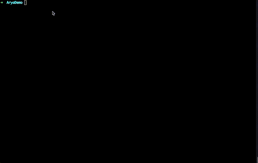
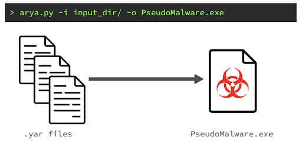
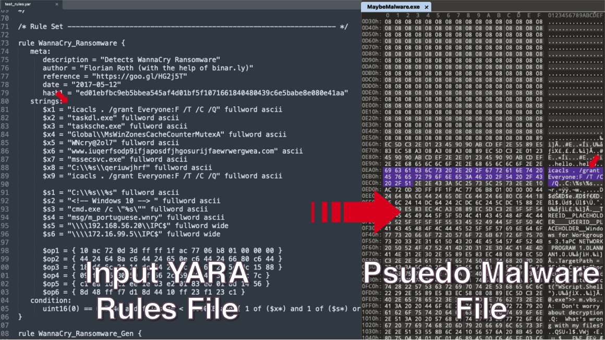

# Arya - The New Tailor-Made EICAR Using Yara
Arya is a unique tool that produces pseudo-malicious files meant to trigger YARA rules

## Intro

YARA rules are an essential tool for security researchers that help them identify and classify malware samples. They do so by describing patterns and strings within malware code that can help an analyst identify known or new threats. YARA rules are also often integrated within commercial detection tools, or used internally to detect misbehaving binaries on the enterprise network.

But what if we don’t have the malicious file we are writing rules for? What if we want to create the “malware” file based on YARA as input? That's why we developed Arya. Arya can be used to generate custom-made, pseudo-malware files to trigger antivirus (AV) and endpoint detection and response (EDR) tools just like the good old EICAR test file. Our tool has a number of use cases, including malware research, YARA rule QA testing, and pressure testing a network with code samples built from YARA rules. 

You can read more about Arya and how it works in our blog.

## More details
Arya is a first-of-its-kind tool; it produces pseudo-malicious files meant to trigger YARA rules. The tool reads the given YARA (.yar suffix) files, parses their syntax using Avast's yaramod package—the YARA parsing engine used in this research—and builds a pseudo “malware” file. Carefully placing desired bytes from the YARA rules to trigger the input rules. 
 
The goal of the tool is to generate a tailor-made pseudo-malicious file that detection sensors such as AV or EDR will identify the result file as the malware file an input YARA rule is meant to detect. To achieve this goal not only are we are adding the necessary signatures, strings, and bytes from the input YARA rules, but also adding some “touches” such as real PE headers, increasing the outfile entropy, adding x86 bytecode, and function prologue/epilogue assembly code. All of this helps the AV/EDR triggering process, and bypasses some heuristics checks they might have.

YARA files (.yar extensions) are text files that contain one or more YARA rules. In this project, we used yaramod to turn YARA rules into a list of rules represented by Python objects, which can then be used to access the internal contents of a rule, such as strings, types, conditions, and more. Yaramond parses YARA rules into AST, or an Abstract Syntax Tree.

Traversal of the abstract syntax tree is done by using a combination of the Observer and Visitor design patterns. For every node that code goes through, it will determine which bytes and strings it needs to place, and where, in order to trigger the condition in the subtree it traverses. As a result, this tree will produce a mapping of strings and possible offsets to put them in; it can also reserve some of them in the file, which will be passed to the placer mechanism for further processing.

## Example Usage Cases
Researchers may use Arya to generate pseudo-malicious files using YARA rules as building blocks. These files can be used to build files that will be identified as specific malware. For example, if you don’t have a Zeus malware sample, but you want to check how your AV reacts to it? No problem, load the Zeus YARA rules to Arya and generate your own “Zeus” like pseudo-malware that AV/EDR tools will identify as Zeus.

Arya can also be used as part of incident response training—similar to purple-teaming—where pseudo-malicious files can be sent across the network to pressure test sensors and detectors in the network.

## Currently Supported Yara functionalities
**Supported**
- Strings - ASCII and Wide
- Hex Streams (including Jumps and Alternations)
- At operator
- Int Functions (uint32, int16be, etc.)
- Of operator (e.g. all of ($s*))

**Planned for the next updates**
- RegEx type support
- Base64 type support
- FileSize Operator
- Range Operator
- String Count Operator

## How to use Arya
### Step 1
Clone this repo and install all requirements

### Step 2
Run Arya considering the following args:
* `-i [INPUT_DIRECTORY] OR [INPUT_FILE]`
* `-o [OUTPUT_FILE_NAME]`
* `--header` - Adds the first 2048 bytes of conficker at the start of the file.
* `-r` - Run recursively on all of the files under \[INPUT_DIRECTORY]
* `-m [MALWARE_FILE]` - Use the file \[INPUT_DIRECTORY] as the base for the output.